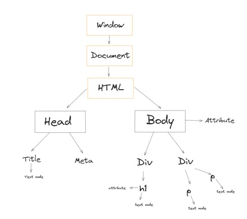

# DOM

* `DOM` stands for `Document Object Model`
* Every HTML document is structured as `DOM`
* `DOM` is basically a tree-like data structure, where each part of the document, such as elements, attributes and text is represented as objects in the tree.
* `DOM` provides a way for Javascript to manipulate the content and structure of web-pages. It means we can use Javascript to 
1. Access and modify HTML documents.
2. Add or remove elements.
3. Change element styles.
4. Handle Events.
5. Manipulate the document structure.

Now suppose if you have the following code
``` javascript
<html>
  <head>
    <meta charset="UTF-8">
    <title>DOM</title>
  </head>
  <body class="bg-black">
    <div>
        <h1 class="first-heading">DOM Introduction</h1>
    </div>
    <div>
        <p>Lorem ipsum eter dolor</p>
        <p>Lorem ipsum eter dolor</p>
    </div>
  </body>
</html>
```
Then the `DOM` chart for the same will look like this


***
[Video Tutorial](https://youtu.be/DcjNkHtDj8A?si=9AIEQLg5iurdQV91)
